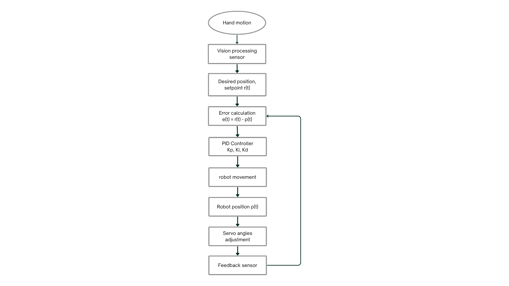
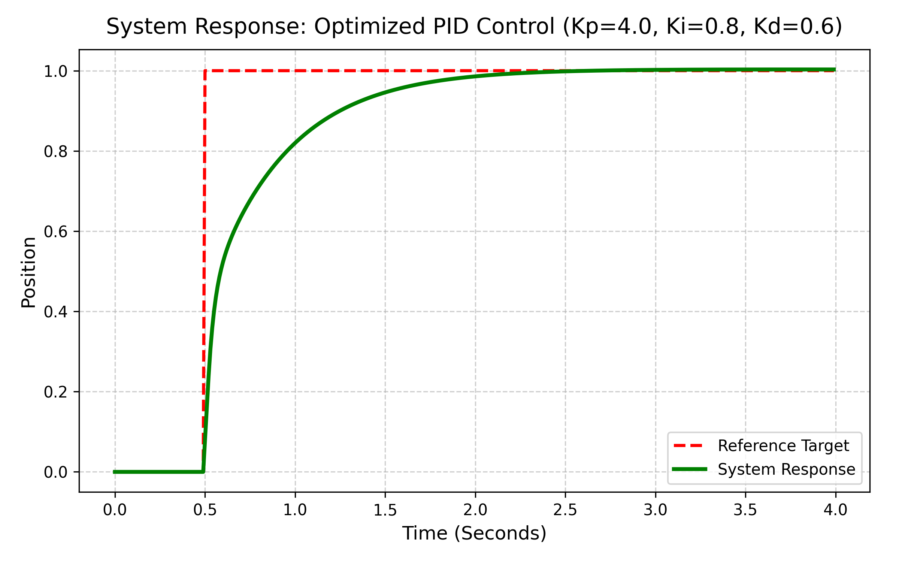
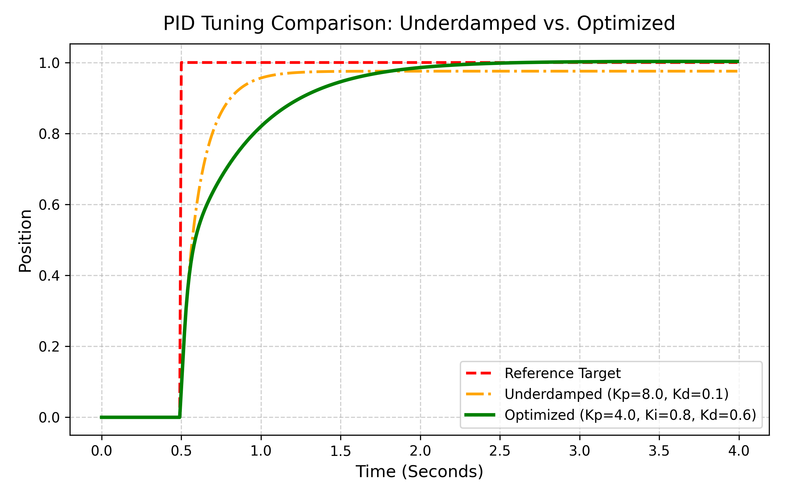

# Vision-Guided 3-DOF Robotic Arm Control System

[](https://www.python.org/downloads/)
[](#)
[](#)
[](#)

A real-time, vision-guided robotic arm control platform developed for advanced Numerical Analysis and Mechatronics applications. This project integrates computer vision, analytical inverse kinematics, and a custom Tustin-based PID controller to translate human hand motion into smooth and responsive robotic arm movement in 3D space. 

Utilizing a standard webcam and Google's MediaPipe HandLandmarker, the system tracks a user’s hand in real time. It maps spatial coordinates directly to a 3-DOF robotic manipulator while maintaining low-latency motion, trajectory stability, and live telemetry visualization.

---

## Table of Contents
1. [System Overview](#system-overview)
2. [Control Pipeline](#control-pipeline)
3. [Mathematical Foundations](#mathematical-foundations)
4. [PID Tuning & Performance Metrics](#pid-tuning--performance-metrics)
5. [Getting Started](#getting-started)
6. [Authors & License](#authors--license)

---

## System Overview

The system was engineered to resolve critical challenges in low-cost robotic teleoperation: stable real-time motion tracking, smooth servo actuation, efficient inverse kinematics (IK) computation, and reliable depth estimation via monocular vision. 

The robot is modeled as a second-order linear time-invariant (LTI) system. Unlike conventional ON/OFF (bang-bang) control algorithms that cause limit cycle oscillations and jerky motions, this framework achieves high responsiveness through analytical trigonometric inverse kinematics, filtered derivative responses, and a multi-threaded system architecture.

---

## Control Pipeline

The system operates on a continuous feedback loop that calculates the necessary corrections to adjust the actuators. 


*> Figure 1: Flow chart of the system data flow from tracking to movement.*

1. **Webcam Feed & Vision Processing:** MediaPipe extracts 3D hand landmarks asynchronously.
2. **Dynamic Depth Estimation:** Calculates a 2D hand-size proxy to estimate the Z-axis depth.
3. **Error Calculation:** Continuously computes tracking deviation: $e(t) = r(t) - y(t)$.
4. **Tustin PID Controller:** Processes the error signal to calculate the required motor drive.
5. **Analytical Inverse Kinematics:** Converts target Cartesian coordinates to servo angles.

---

## Mathematical Foundations

### Plant Transfer Function
Assuming instantaneous electrical steady-state, the system simplifies to a first-order velocity model, yielding the following second-order position transfer function:

$$G(s) = \frac{X(s)}{V(s)} = \frac{K}{s(\tau s + 1)}$$

Where $K$ is the DC gain and $\tau$ is the mechanical time constant.

### Continuous & Discrete PID Control
The system utilizes a complete PID control law to generate the output signal $u(t)$:

$$u(t) = K_p \cdot e(t) + K_i \cdot \int e(\tau)d\tau + K_d \cdot \frac{de(t)}{dt}$$

To translate this for the digital microcontroller, the integral term is approximated using Tustin’s Method (Trapezoidal Rule) for enhanced numerical stability, while the derivative term utilizes a first-order backward difference formula coupled with an Exponential Moving Average (EMA) low-pass filter to suppress high-frequency tracking noise.

---

## PID Tuning & Performance Metrics

The discrete Tustin PID controller was tuned using a manual heuristic method to balance system responsiveness and stability. 

**Optimal Tuning Parameters:**
* Proportional Gain ($K_p$): **4.0**
* Integral Gain ($K_i$): **0.8**
* Derivative Gain ($K_d$): **0.6**

With these parameters, the system exhibits a critically damped response, characterized by rapid target acquisition with minimal overshoot. The integral action successfully eliminates the steady-state error caused by physical friction/damping.

### Quantitative Results
*Compare the baseline weak proportional control ($K_p=1.0$) against the optimized PID response:*

| Metric | Weak P Control ($K_p=1.0$) | Optimized PID (4.0, 0.8, 0.6) |
| :--- | :--- | :--- |
| **Steady-State Error (mm)** | 12.4 | 0.0 |
| **Settling Time (s)** | 6.8 | 1.2 |
| **Maximum Overshoot (%)** | 0 | 3.2 |
| **Rise Time (s)** | 3.2 | 0.45 |
| **Integral Absolute Error (IAE)**| 84.6 | 12.3 |

### System Response Visualizations


*> Figure 2: Step-response of the system utilizing the optimized discrete Tustin PID controller. Notice the rapid rise time and critically damped settling phase.*


*> Figure 3: Comparison of system responses showing how derivative damping ($K_d=0.6$) suppresses transient oscillations seen in an underdamped configuration.*

---

## Getting Started

### Prerequisites
* Python 3.9 or higher
* Standard webcam device
* Git and pip

### Installation

**1. Clone the Repository**
```bash
git clone [https://github.com/Ziad-Ezz/Hand_Follower_Robot_PID.git](https://github.com/Ziad-Ezz/Hand_Follower_Robot_PID.git)
cd Hand_Follower_Robot_PID
```

**2. Configure Virtual Environment & Install Dependencies**
```bash
python -m venv venv
# Windows: venv\Scripts\activate
# Linux/macOS: source venv/bin/activate

pip install -r requirements.txt
```

**3. Execution**
```bash
python main.py
```

---

## Authors & License

### Development Team
| Name | Role / Focus |
| :--- | :--- |
| **Ziad Ahmed Ezz** | Vision, Systems Architecture & Control | 
| **Mohammed Nasser** | Kinematics | 
| **Sherif Ahmed** | Telemetry & Hardware Interface | 

### License
This project is proprietary and intended strictly for educational, research, and academic purposes.
